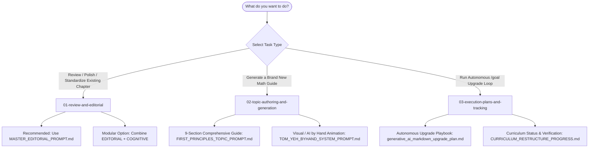

# 📚 Master Prompts Directory & Usage Architecture

Welcome to the **Master Prompts Catalog** for the `Mathematical-Foundations-of-ML` repository. This directory contains all authoritative prompt engineering assets, editorial standards, cognitive learning frameworks, topic authoring templates, and autonomous agent execution plans.

---

## 🗺️ Prompt Selection Flowchart

Use the decision flowchart below to select the exact prompt for your task:



---

## 📂 Subfolder Segregation & Detailed Usage Map

### 1. [`01-review-and-editorial/`](./01-review-and-editorial/)
> **Core Purpose:** System prompts and operator guides for **auditing, reviewing, and standardizing** existing mathematical chapters in `MathsTerms/` or lecture modules (`NOTES.md`).

| File | Type | When & Where to Use It |
| :--- | :--- | :--- |
| [`MASTER_EDITORIAL_PROMPT.md`](./01-review-and-editorial/MASTER_EDITORIAL_PROMPT.md) | **Master System Prompt** *(Recommended)* | **Where:** Pass as the System Prompt to an LLM when auditing or revising an existing chapter.<br>**When:** Reviewing any guide to enforce the **14 substantive sections**, step-by-step arithmetic, zero-leap derivations, spoken phonetics, ASCII diagrams, and GenAI bridges. |
| [`EDITORIAL_SYSTEM_PROMPT.md`](./01-review-and-editorial/EDITORIAL_SYSTEM_PROMPT.md) | **Modular Reference** | **Where:** Editorial audit pipelines.<br>**When:** Referenced for detailed section-by-section rules and the strict exception policy for merging/removing sections. |
| [`COGNITIVE_LEARNING_ENGINE_SYSTEM_PROMPT.md`](./01-review-and-editorial/COGNITIVE_LEARNING_ENGINE_SYSTEM_PROMPT.md) | **Modular Reference** | **Where:** Deep pedagogical reviews.<br>**When:** Enforcing cognitive science techniques: Socratic questions, Feynman ELI5 explanations, dual coding, and retrieval/transfer exercises. |
| [`SYSTEM_PROMPTS_USAGE.md`](./01-review-and-editorial/SYSTEM_PROMPTS_USAGE.md) | **Operator Guide** | **Where:** Human / Agent operator playbook.<br>**When:** Contains copy-paste task instructions, mode flags (`Review only` vs `Review and revise`), and context bundling advice. |

---

### 2. [`02-topic-authoring-and-generation/`](./02-topic-authoring-and-generation/)
> **Core Purpose:** System and task prompts for **authoring brand-new mathematical concept guides** and visual explanations from scratch.

| File | Type | When & Where to Use It |
| :--- | :--- | :--- |
| [`FIRST_PRINCIPLES_TOPIC_PROMPT.md`](./02-topic-authoring-and-generation/FIRST_PRINCIPLES_TOPIC_PROMPT.md) | **Task / System Prompt** | **Where:** Generating new math terms for `MathsTerms/` (e.g., SVD, Covariance, PCA, Dirichlet Distributions).<br>**When:** You provide a topic name; the LLM outputs a complete **9-section first-principles guide** with ASCII diagrams, worked micro-numbers, PyTorch verification script, and diagnostic tests. |
| [`TOM_YEH_BYHAND_SYSTEM_PROMPT.md`](./02-topic-authoring-and-generation/TOM_YEH_BYHAND_SYSTEM_PROMPT.md) | **System Prompt** | **Where:** Creating intuitive, visual, by-hand lessons inspired by Prof. Tom Yeh.<br>**When:** Explaining neural network activations, matrix math, or loss functions through physical metaphors (boba shops, flood gates) and step-by-step hand arithmetic. |
| [`PromptWords.txt`](./02-topic-authoring-and-generation/PromptWords.txt) | **Reference Scratchpad** | **Where:** Quick prompt drafting and prompt chaining.<br>**When:** Contains raw keywords and pedagogical guardrails (ELI5, no sudden jumps, physical analogies, spoken pronunciations). |

---

### 3. [`03-execution-plans-and-tracking/`](./03-execution-plans-and-tracking/)
> **Core Purpose:** Autonomous execution plans and curriculum tracking ledgers.

| File | Type | When & Where to Use It |
| :--- | :--- | :--- |
| [`generative_ai_markdown_upgrade_plan.md`](./03-execution-plans-and-tracking/generative_ai_markdown_upgrade_plan.md) | **Autonomous Execution Plan** | **Where:** Executed by AI agents during long-running `/goal` sessions.<br>**When:** Step-by-step playbook for upgrading lecture folders to the **7-Pillar Production Learning Suite** (`PREREQUISITES.md`, `NOTES.md`, `references.md`, `examples/`, `glossary.md`, `formulae_sheet.md`, `quiz.html`). |
| [`CURRICULUM_RESTRUCTURE_PROGRESS.md`](./03-execution-plans-and-tracking/CURRICULUM_RESTRUCTURE_PROGRESS.md) | **Progress & Evidence Ledger** | **Where:** Repository audit & documentation.<br>**When:** Historical and operational record of how the `MathsTerms/` directory was restructured into 6 sequenced pillars with link verification. |

---

## ⚡ Quick-Start Usage Examples

### Example A: Auditing & Revising an Existing Chapter
1. Open your LLM interface (Claude, Gemini, or ChatGPT).
2. Set the System Prompt to [`MASTER_EDITORIAL_PROMPT.md`](./01-review-and-editorial/MASTER_EDITORIAL_PROMPT.md).
3. Send the user message:
   ```text
   Mode: Review and revise.
   Target File: MathsTerms/01-Linear-Algebra-Geometry-and-Tensors/01_Vectors_and_Spaces.md
   
   Ensure all 14 canonical sections are present, derivations have zero algebraic leaps,
   all Greek symbols have phonetic pronunciations, and include a runnable PyTorch verification script.
   ```

### Example B: Generating a Brand-New Concept Guide from Scratch
1. Set the System Prompt to [`FIRST_PRINCIPLES_TOPIC_PROMPT.md`](./02-topic-authoring-and-generation/FIRST_PRINCIPLES_TOPIC_PROMPT.md).
2. Send the user message:
   ```text
   TOPIC: "Singular Value Decomposition (SVD)"
   
   Generate the complete 9-section first-principles guide following all pedagogical constraints.
   ```
